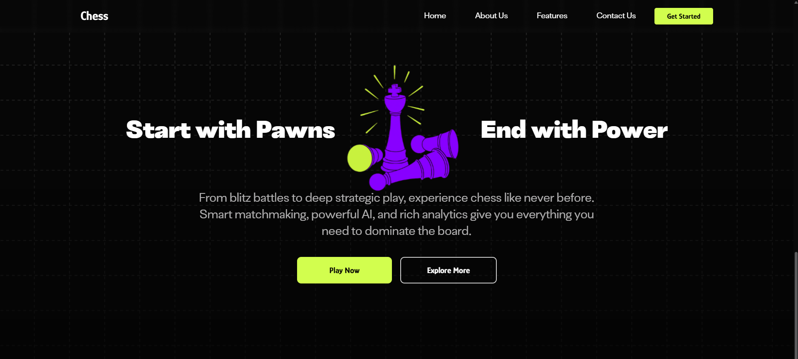
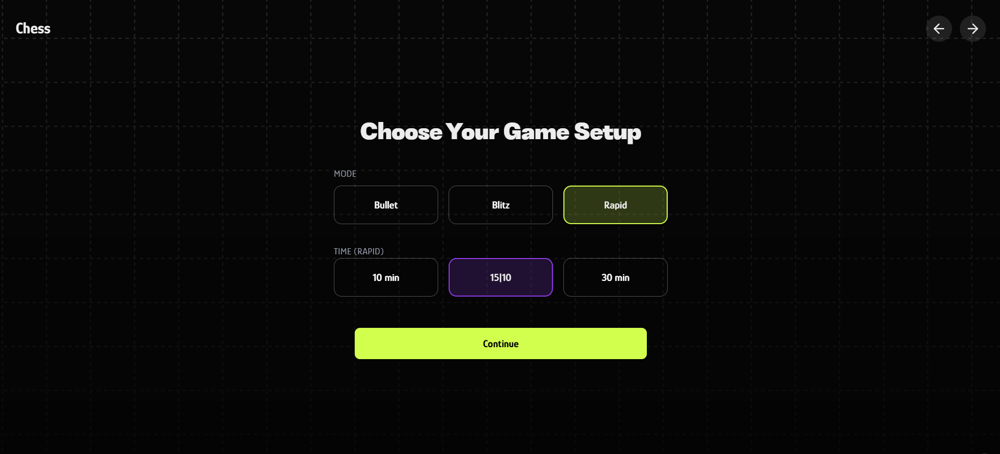
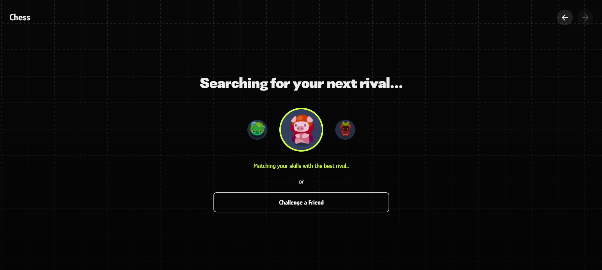
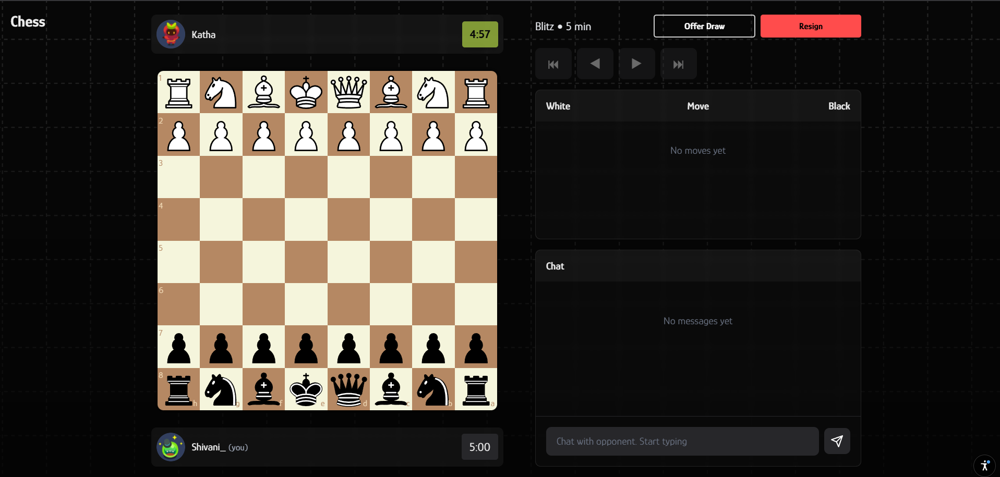
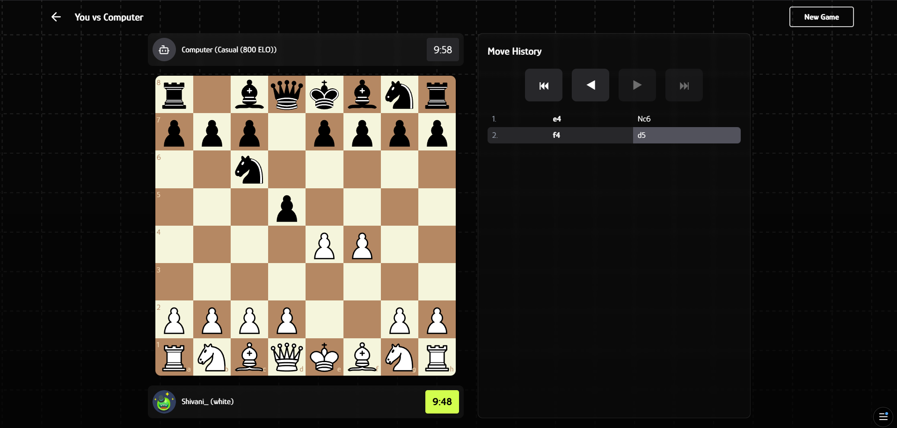
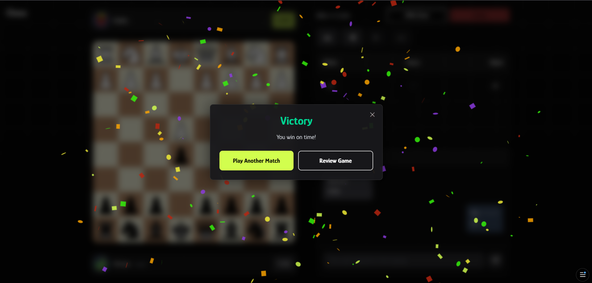
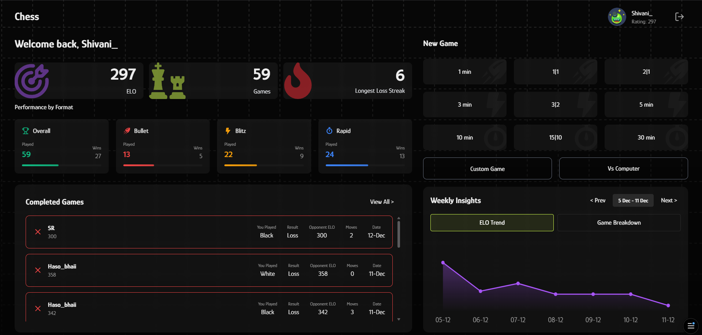

# ♟️ Modern Chess Platform

A fast, competitive, and intelligent online chess platform built for players of all skill levels. Play instantly through **Guest Mode**, compete with real opponents via **matchmaking**, or sharpen your strategies against a powerful **Stockfish AI** engine.

## 📸 Platform Preview

  <table>
    <tr>
      <td width="50%">
        
        
<b>Welcome Screen</b>

      </td>
      <td width="50%">
        
        
<b>Game Setup & Time Controls</b>

      </td>
    </tr>
    <tr>
      <td width="50%">
        
        
<b>Real-Time Matchmaking</b>

      </td>
      <td width="50%">
        
        
<b>Match Found</b>

      </td>
    </tr>
  </table>

# 🌟 Key Features

## 🧩 **Instant Play — No Account Needed**

* Jump into games instantly with **Guest Mode**
* Automatically assigns a temporary username and rating
* No signup required unless you want to save progress

## ⚔️ Online Multiplayer & Matchmaking

* **Real-time matchmaking** with WebSockets
* Balanced pairing using the **ELO rating system**
* Smooth, low-latency gameplay with server-synced clocks
* Supports **live games**, **draw offers**, and **resignation**

## 🤖 Intelligent AI (Stockfish Integration)

* Play against the computer with **six difficulty levels**
* Ratings range from **400 → 2400+ ELO**
* Perfect for learning, practice, and warm-up gameplay

## ⏱️ Multiple Time Formats

Choose from a variety of time controls:

* **1 min**, **3 min**, **5 min** (Blitz)
* **10 min**, **15|10**, **30 min**
* **Custom game formats**
* Supports both **real-time** and **increment** clocks

## 📊 Performance Analytics & Insights

Understand your progress with detailed stats:

* Win/loss rate by format (Bullet, Blitz, Rapid)
* Completed game history with opponent rating
* Interactive **move-by-move navigation**
* Weekly ELO trend visualization
* Game breakdown and strategic insights

## 🎮 Enhanced Gameplay Experience

* Smooth **drag & drop** or **click-to-move** interaction
* **Move previews**, **legal move highlights**, and **check indicators**
* **Premove support** for fast time formats
* Promotion dialog for pawn promotions (Queen, Rook, Bishop, Knight)

## 💬 Real-Time Chat System

* In-game chat with your opponent
* Desktop & mobile optimized chat panel
* Smart notifications when chat is closed

## 🖥️ Modern UI/UX

* Clean, minimalistic, highly responsive interface
* Optimized separately for **desktop** and **mobile** layouts
* Professional dark theme with subtle grid background
* Smooth animations and intuitive controls throughout

## 🔒 Fair Play & Reliability

* Accurate server-side move validation
* Anti-cheat safeguards
* Safe reconnection handling
* Graceful timeout and game-resume logic

## 🚀 What Makes This Platform Special?

This platform focuses on:

* **Ultra-fast access** — even without login
* **Rich analytics** for improvement
* **Modern UI** matching premium chess apps
* **Stockfish-powered AI training**
* **Competitive matchmaking** for serious players

Whether you're learning, practicing, or sweating through blitz matches — this platform gives you a world-class chess experience.

## 🎯 Gameplay Experience

  <table>
    <tr>
      <td width="50%">
        
        
<b>Live Multiplayer Game</b>

      </td>
      <td width="50%">
        
        
<b>AI Opponent (Stockfish)</b>

      </td>
    </tr>
    <tr>
      <td width="50%">
        
        
<b>Game Result & Rating </b>

      </td>
      <td width="50%">
        
        
<b>Performance Dashboard</b>

      </td>
    </tr>
  </table>

## Tech Stack

### Frontend
- **Next.js 14+** with App Router
- **React 18+** with modern hooks (useState, useEffect, useCallback, useRef)
- **TypeScript** for type-safe development
- **Tailwind CSS** for responsive styling
- **Framer Motion** for smooth animations
- **react-chessboard** for interactive board rendering
- **chess.js** for game logic and validation
- **Zustand** for state management
- **Lucide React** for modern iconography
- **Stockfish** chess engine integration

### Backend
- **Node.js** with Express
- **MongoDB** with Mongoose ODM
- **WebSocket (Socket.io)** for real-time game communication
- **JWT** authentication

### Infrastructure
- **Vercel** deployment
- **RESTful API** architecture
- **Email service** for authentication (OTP verification)

## Future Enhancements

We're continuously improving the platform with exciting features on the roadmap:

- **Challenge a Friend**: Send direct game invitations to specific players
- **Custom Games**: Create private lobbies with custom rules and time controls
- **Tournaments**: Organized competitive events with brackets and prizes
- **Puzzle Mode**: Daily chess puzzles to sharpen tactical skills
- **Opening Library**: Study popular openings with move sequences
- **Game Analysis**: AI-powered move analysis and improvement suggestions
- **Social Features**: Friend lists, chat, and player profiles

## Try it Out

Experience competitive chess online: [Play Now](https://chess-xi-ivory.vercel.app/)

